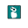

# 🎨 BBIA BRANDING

<div align="center">

**Assets Premium pour l'identité visuelle BBIA**

[](https://github.com)
[](https://github.com)
[](LICENSE)
[](LICENSE)
[](https://www.python.org/)
[](https://inkscape.org/)
[](https://github.com)
[](logo_2d/final/)
[](docs/)
[](logo_2d/final/)
[](logo_2d/final/tests_visuels/)
[](variants/)
[](https://github.com/arkalia-luna-system)
[](https://github.com/arkalia-luna-system/bbia-sim)

[Logo 2D](#-logo-2d) • [Style Guide](#-style-guide) • [Documentation](#-documentation) • [Scripts](#️-scripts--automatisation)

---

<div align="center">
  
  
  
  <h1>🎨 BBIA BRANDING</h1>
  
  <h3>Identité visuelle premium pour BBIA Reachy Mini</h3>
  
  <p>
    <strong>Le robot cognition purement open, simulation fidèle, design IA premium</strong>
  </p>
  
  <blockquote>
    <p><strong>BBIA</strong> — Branding pour une IA robotique inspirée, ouverte et connectée.</p>
  </blockquote>
  
  <p>
    <a href="#-logo-2d">📐 Logos</a> •
    <a href="#-style-guide">🎨 Style Guide</a> •
    <a href="#-exemples-dusage">💡 Exemples</a> •
    <a href="#️-scripts--automatisation">🤖 Scripts</a>
  </p>
  
  <p>
    <a href="https://github.com/arkalia-luna-system/bbia_branding">📦 Repository</a> •
    <a href="#-progression">📊 Progression</a> •
    <a href="#-démarrage-rapide">🚀 Quick Start</a>
  </p>
  
</div>

---

## 📋 TABLE DES MATIÈRES

- [🎯 Vue d'ensemble](#-vue-densemble)
- [🎨 Logo 2D](#-logo-2d)
- [📐 Style Guide](#-style-guide)
- [🛠️ Scripts & Automatisation](#️-scripts--automatisation)
- [📚 Documentation](#-documentation)
- [📊 Progression](#-progression)
- [🚀 Démarrage rapide](#-démarrage-rapide)

---

## 🎯 VUE D'ENSEMBLE

<div align="center">

**BBIA Branding** est une collection complète d'assets visuels premium pour l'identité de marque BBIA. Le projet inclut des logos vectoriels, des guides de style, des scripts d'automatisation et une documentation complète.

> 🤖 **Logo officiel pour BBIA Reachy Mini** — Moteur cognitif robotique open-source  
> 🔗 **Projet principal** : [BBIA-SIM](https://github.com/arkalia-luna-system/bbia-sim) — Simulation MuJoCo, IA, Vision, Émotions

</div>

### 📖 Histoire du robot BBIA — Pourquoi ce branding ?

**BBIA (Brain-Based Intelligent Assistant)** est un moteur cognitif robotique open-source pour Reachy Mini, développé par [Arkalia Luna System](https://github.com/arkalia-luna-system). Le projet [BBIA-SIM](https://github.com/arkalia-luna-system/bbia-sim) intègre :

- 🤖 **Simulation MuJoCo** : Simulation haute fidélité du robot Reachy Mini
- 🧠 **IA & Émotions** : Système d'émotions et de cognition
- 👁️ **Vision** : Détection d'objets, visages, postures (YOLO, MediaPipe, DeepFace)
- 🗣️ **Communication** : STT/TTS, LLM (HuggingFace), WebSocket
- 🎯 **SDK Officiel** : 100% conforme au SDK Reachy Mini

Ce branding a été créé pour :

- ✅ **Identité visuelle cohérente** : Un logo reconnaissable pour tous les projets BBIA
- ✅ **Open-source friendly** : Assets libres et réutilisables pour la communauté
- ✅ **Simulation & Réalité** : Logo adapté pour [BBIA-SIM](https://github.com/arkalia-luna-system/bbia-sim) et le robot physique
- ✅ **Intégration Arkalia Luna** : Compatible avec le générateur de logos multi-robots
- ✅ **Professionnalisme** : Design premium pour publications, présentations, documentation

> 💡 **Vision** : Un branding qui reflète l'innovation, l'ouverture et l'excellence technique de BBIA

### ✨ Caractéristiques

<div align="center">

| 🎨 Visuel | 📐 Formats | 🤖 Automatisation | 📚 Documentation |
|-----------|-----------|-------------------|------------------|
| ✅ Logos vectoriels (SVG) haute qualité | ✅ Multi-formats (PNG, SVG) | ✅ Scripts Python | ✅ 15+ guides |
| ✅ 5 logos créés | ✅ Déclinaisons complètes | ✅ Génération automatique | ✅ Style Guide complet |
| ✅ 29 mockups de test | ✅ Tests visuels | ✅ Inkscape intégré | ✅ Exemples d'usage |

**📊 Progression globale : 90%** | **🎯 Objectif : 100%**

</div>

---

## 🎨 LOGO 2D

### 📋 Index visuel des logos

<div align="center">

**🎨 Aperçu de tous les logos disponibles — Cliquez pour voir les détails**

<table>
<tr>
<td align="center" width="25%">
  <a href="#-mark-only-symbole-seul">
    <br>
    <strong>Mark Only</strong><br>
    <small>Symbole seul</small>
  </a>
</td>
<td align="center" width="25%">
  <a href="#-logo-vertical-symbole--texte-empilés">
    <br>
    <strong>Logo Vertical</strong><br>
    <small>Symbole + texte empilés</small>
  </a>
</td>
<td align="center" width="25%">
  <a href="#-logo-horizontal-symbole--texte-côte-à-côte">
    <br>
    <strong>Logo Horizontal</strong><br>
    <small>Symbole + texte côte à côte</small>
  </a>
</td>
<td align="center" width="25%">
  <a href="#-mark-only-symbole-seul">
    <br>
    <strong>Favicon</strong><br>
    <small>32×32px</small>
  </a>
</td>
</tr>
</table>

> 💡 **Astuce** : Cliquez sur chaque logo pour voir les détails et les fichiers disponibles

</div>

### Versions disponibles

<div align="center">

#### 🎯 Mark Only (Symbole seul)

<div align="center">

> **📋 Info Card — Mark Only**  
> **Usage** : Favicon, icônes d'application, badges, espaces réduits, watermark  
> **Recommandé pour** : 🌐 Internet (favicon), 📱 Apps (iOS/Android), 🔖 Badges, 🎪 Événements


| Format | Fichier | Usage | Taille |
|--------|---------|-------|--------|
| 🎨 **SVG** | `bbia_mark_only_v2_SOURCE.svg` | Vectoriel source (fichier principal) | Scalable |
| 🖼️ **PNG** | `bbia_mark_only_v2.png` | Haute résolution (taille originale) | Originale |
| 🌐 **PNG** | `bbia_mark_only_512x512.png` | Web (512×512px) | 512×512px |
| 🔖 **PNG** | `bbia_favicon_32x32.png` | Favicon (32×32px) | 32×32px |

</div>

#### 📄 Logo Vertical (Symbole + texte empilés)

<div align="center">

> **📋 Info Card — Logo Vertical**  
> **Usage** : En-têtes de documents, signatures email, cartes de visite, affiches verticales, headers de site web  
> **Recommandé pour** : 📄 Documents (PDF/Word), 📧 Email, 💼 Print professionnel, 🎪 Événements verticaux


| Format | Fichier | Dimensions | Usage |
|--------|---------|------------|-------|
| 🎨 **SVG** | `bbia_logo_vertical_v2_SOURCE.svg` | Vectoriel source | Édition, print |
| 🖼️ **PNG** | `bbia_logo_vertical_v2.png` | Haute résolution | Web, documents |

</div>

#### ➡️ Logo Horizontal (Symbole + texte côte à côte)

<div align="center">

> **📋 Info Card — Logo Horizontal**  
> **Usage** : Headers de site web, bannières, en-têtes de documents larges, présentations, flyers  
> **Recommandé pour** : 🌐 Internet (headers), 📰 Affiches larges, 🎪 Bannières événements, 📄 Documents larges


| Format | Fichier | Dimensions | Usage |
|--------|---------|------------|-------|
| 🎨 **SVG** | `bbia_logo_horizontal_SOURCE.svg` | Vectoriel source | Édition, print |
| 🖼️ **PNG** | `bbia_logo_horizontal.png` | 1024px largeur | Web, bannières |

</div>

</div>

### 📁 Emplacement et téléchargement

<div align="center">

**📦 Tous les logos sont dans : [`logo_2d/final/`](logo_2d/final/)**

</div>

#### 📥 Fichiers sources (SVG) — Téléchargeables

| Fichier | Usage | Télécharger |
|---------|-------|------------|
| `bbia_mark_only_v2_SOURCE.svg` | Mark Only (source vectorielle) | [📥 SVG](logo_2d/final/bbia_mark_only_v2_SOURCE.svg) |
| `bbia_logo_vertical_v2_SOURCE.svg` | Logo vertical (source) | [📥 SVG](logo_2d/final/bbia_logo_vertical_v2_SOURCE.svg) |
| `bbia_logo_horizontal_SOURCE.svg` | Logo horizontal (source) | [📥 SVG](logo_2d/final/bbia_logo_horizontal_SOURCE.svg) |

#### 🖼️ Fichiers finaux (PNG) — Téléchargeables

| Fichier | Usage | Taille | Télécharger |
|---------|-------|--------|-------------|
| `bbia_mark_only_v2.png` | Mark Only haute résolution | Originale | [📥 PNG](logo_2d/final/bbia_mark_only_v2.png) |
| `bbia_mark_only_512x512.png` | Mark Only web | 512×512px | [📥 PNG](logo_2d/final/bbia_mark_only_512x512.png) |
| `bbia_logo_vertical_v2.png` | Logo vertical haute résolution | Originale | [📥 PNG](logo_2d/final/bbia_logo_vertical_v2.png) |
| `bbia_logo_horizontal.png` | Logo horizontal web | 1024px largeur | [📥 PNG](logo_2d/final/bbia_logo_horizontal.png) |
| `bbia_favicon_32x32.png` | Favicon | 32×32px | [📥 PNG](logo_2d/final/bbia_favicon_32x32.png) |

> 💡 **Télécharger tous les logos** : Clonez le repository ou téléchargez le dossier [`logo_2d/final/`](logo_2d/final/) complet

### 🎬 Logo en situation réelle

<div align="center">

**📸 Exemples d'utilisation du logo dans différents contextes**

> 💡 **Note** : Des animations et vidéos du logo en situation réelle (robot, site, app, print) seront ajoutées prochainement

</div>

### 🎨 Tests visuels sur différents fonds

<div align="center">

**Logo Mark Only testé sur différents fonds et formats pour vérifier la lisibilité**

#### Mockups simples (4 fonds)

| Fond Blanc | Fond Noir Foncé | Fond Bleu BBIA | Fond Noir Pur |
|------------|-----------------|----------------|---------------|
|  |  |  |  |
| `#FFFFFF` | `#020202` | `#008181` | `#000000` |

#### Mockups améliorés (formats variés)

**Format Card (400×300)** - Pour cartes et vignettes

| Fond Blanc | Fond Bleu | Fond Noir |
|------------|-----------|-----------|
|  |  |  |

**Format Banner (800×200)** - Pour en-têtes et bannières

| Fond Blanc | Fond Bleu | Fond Noir |
|------------|-----------|-----------|
|  |  |  |

**Format Badge (300×300)** - Pour badges et icônes circulaires

| Fond Blanc | Fond Bleu | Fond Gris |
|------------|-----------|-----------|
|  |  |  |

**✅ Tous les mockups utilisent le logo depuis `bbia_mark_only_v2_SOURCE.svg`**

**📊 Total : 25 mockups** (5 formats × 5 fonds)

</div>

> **💡 Générer les mockups** :
> - **Mockups simples** : `cd logo_2d/final && python3 create_visual_tests.py`
> - **Mockups améliorés** : `cd logo_2d/final && python3 create_enhanced_mockups.py`

---

## 📐 STYLE GUIDE

### Palette de couleurs

<div align="center">

**🎨 Swatch visuel des couleurs officielles BBIA**

<table>
<tr>
<th>Couleur</th>
<th>Échantillon</th>
<th>Hex</th>
<th>RGB</th>
<th>Usage</th>
</tr>
<tr>
<td><strong>BBIA Blue</strong></td>
<td><div style="width:80px;height:80px;background-color:#008181;border:3px solid #333;border-radius:8px;margin:0 auto;"></div></td>
<td><code>#008181</code></td>
<td><code>RGB(0, 129, 129)</code></td>
<td>Fond du logo (carré bleu)</td>
</tr>
<tr>
<td><strong>BBIA White</strong></td>
<td><div style="width:80px;height:80px;background-color:#FFFFFF;border:3px solid #333;border-radius:8px;margin:0 auto;"></div></td>
<td><code>#FFFFFF</code></td>
<td><code>RGB(255, 255, 255)</code></td>
<td>Corps du robot</td>
</tr>
<tr>
<td><strong>BBIA Gray Light</strong></td>
<td><div style="width:80px;height:80px;background-color:#CCCCCC;border:3px solid #333;border-radius:8px;margin:0 auto;"></div></td>
<td><code>#CCCCCC</code></td>
<td><code>RGB(204, 204, 204)</code></td>
<td>Yeux du robot</td>
</tr>
<tr>
<td><strong>BBIA Black Dark</strong></td>
<td><div style="width:80px;height:80px;background-color:#020202;border:3px solid #333;border-radius:8px;margin:0 auto;"></div></td>
<td><code>#020202</code></td>
<td><code>RGB(2, 2, 2)</code></td>
<td>Détails et ombres</td>
</tr>
<tr>
<td><strong>BBIA Black</strong></td>
<td><div style="width:80px;height:80px;background-color:#000000;border:3px solid #333;border-radius:8px;margin:0 auto;"></div></td>
<td><code>#000000</code></td>
<td><code>RGB(0, 0, 0)</code></td>
<td>Texte "BBIA"</td>
</tr>
</table>

> 💡 **Note** : Ces couleurs sont extraites directement des fichiers SVG `_SOURCE.svg`. Voir [`logo_2d/final/COULEURS_OFFICIELLES.md`](logo_2d/final/COULEURS_OFFICIELLES.md) pour les détails complets.

</div>

> **Note** : Ces couleurs sont extraites directement des fichiers SVG `_SOURCE.svg`. Voir [`logo_2d/final/COULEURS_OFFICIELLES.md`](logo_2d/final/COULEURS_OFFICIELLES.md) pour les détails complets.

### Typographie

- **Titres** : Inter Bold, 48px (desktop) / 32px (mobile)
- **Corps** : Inter Regular, 16px (desktop) / 14px (mobile)
- **Code** : JetBrains Mono Regular, 14px

### Documentation complète

📄 **[Style Guide One-Page](style_guide/STYLE_GUIDE_ONE_PAGE.md)** - Guide synthétique  
📄 **[Palette Couleurs](style_guide/palette_couleurs.md)** - Détails couleurs  
📄 **[Typographie](style_guide/typographie.md)** - Détails typographie  
📄 **[Usage Logo](style_guide/usage_logo.md)** - Règles d'usage

---

## 🛠️ SCRIPTS & AUTOMATISATION

### Scripts disponibles

| Script | Statut | Description | Usage |
|--------|--------|-------------|-------|
| `reexport_correct_colors.py` | ✅ **Principal** | Réexporte les logos avec Inkscape depuis `_SOURCE.svg` | `python3 reexport_correct_colors.py` |
| `generate_all_logos.py` | ✅ Actif | Vérifie et génère tous les logos manquants | `python3 generate_all_logos.py` |
| `create_horizontal_logo.py` | ✅ Actif | Crée le logo horizontal depuis le vertical | `python3 create_horizontal_logo.py` |
| `create_visual_tests.py` | ✅ Actif | Génère des mockups simples (4 fonds) | `python3 create_visual_tests.py` |
| `create_enhanced_mockups.py` | ✅ **Amélioré** | Génère des mockups professionnels (25 variantes) | `python3 create_enhanced_mockups.py` |
| `open_visual_tests.py` | ✅ Actif | Ouvre les tests visuels et le favicon | `python3 open_visual_tests.py` |
| `extract_colors_from_svg.py` | ✅ Actif | Extrait les couleurs depuis les SVG `_SOURCE.svg` | `python3 extract_colors_from_svg.py` |
| `optimize_images_for_github.py` | ✅ Actif | Optimise les images pour GitHub | `python3 optimize_images_for_github.py` |
| `organize_files.py` | ✅ Actif | Organise les fichiers anciens | `python3 organize_files.py` |

### 🤖 Automatisation avec Arkalia-LUNA

**Scripts préparés** (quand BBIA Branding dans T7) :

- ✅ `bbia_generate_declinations.py` - Génération déclinaisons dimensionnelles
  - Génère automatiquement : Square 1:1, Landscape 16:9, Portrait 9:16
  - Crée toutes les tailles : 1080×1080px, 1920×1080px, 512×512px, etc.
  - Format : `python3 bbia_generate_declinations.py`
  
- ✅ `bbia_visual_tests.py` - Tests visuels automatiques
  - Génère des mockups sur différents fonds
  - Vérifie la lisibilité automatiquement
  - Format : `python3 bbia_visual_tests.py`

📄 Voir [`ACTIVATION_SCRIPTS_T7.md`](ACTIVATION_SCRIPTS_T7.md) pour l'activation.

### 🚀 Génération en une commande

Pour générer **toutes les déclinaisons PNG** depuis les SVG sources :

```bash
cd logo_2d/final

# Étape 1 : Réexporter tous les logos depuis _SOURCE.svg
python3 reexport_correct_colors.py

# Étape 2 : Vérifier et générer les logos manquants
python3 generate_all_logos.py

# Étape 3 : Créer les mockups de test visuel
python3 create_visual_tests.py          # Mockups simples (4 fonds)
python3 create_enhanced_mockups.py       # Mockups améliorés (25 variantes)

# Étape 4 : Optimiser les images pour GitHub
python3 optimize_images_for_github.py

# (Quand dans T7) Étape 5 : Générer toutes les déclinaisons dimensionnelles
# python3 bbia_generate_declinations.py
```

---

## 📚 DOCUMENTATION

### Guides Logo 2D

- 📄 **[SOLUTION_LOGO_EXACT.md](logo_2d/SOLUTION_LOGO_EXACT.md)** - Workflow complet logo exact
- 📄 **[GUIDE_STYLISATION.md](logo_2d/GUIDE_STYLISATION.md)** - Comment styliser
- 📄 **[COMPARAISON_INKSCAPE_FIGMA.md](logo_2d/COMPARAISON_INKSCAPE_FIGMA.md)** - Comparaison outils
- 📄 **[DECLINAISONS_MARK_ONLY.md](logo_2d/DECLINAISONS_MARK_ONLY.md)** - Versions mark only
- 📄 **[TESTS_FOND_SOMBRE.md](logo_2d/TESTS_FOND_SOMBRE.md)** - Tests sur fonds sombres
- 📄 **[INSTALLATION_INKSCAPE_T7.md](logo_2d/INSTALLATION_INKSCAPE_T7.md)** - Installation Inkscape

### Guides Validation & Tests

- 📄 **[VALIDATION_FINALE.md](VALIDATION_FINALE.md)** - Checklist complète
- 📄 **[AUDIT_FINAL.md](AUDIT_FINAL.md)** - Audit complet du projet
- 📄 **[GUIDE_TEST_VISUEL.md](GUIDE_TEST_VISUEL.md)** - Guide test visuel
- 📄 **[TESTS_VISUELS_RESULTATS.md](TESTS_VISUELS_RESULTATS.md)** - Résultats tests

### Guides Intégration

- 📄 **[INTEGRATION_ARKALIA_LUNA.md](INTEGRATION_ARKALIA_LUNA.md)** - Intégration Arkalia-LUNA
- 📄 **[ACTIVATION_SCRIPTS_T7.md](ACTIVATION_SCRIPTS_T7.md)** - Activation scripts T7

### Références

- 📄 **[COULEURS_OFFICIELLES.md](logo_2d/final/COULEURS_OFFICIELLES.md)** - 🎨 **Palette officielle** (couleurs extraites des `_SOURCE.svg`)
- 📄 **[README_LOGOS.md](logo_2d/final/README_LOGOS.md)** - Répertoire complet des logos

---

## 🔗 QUICK LINKS

<div align="center">

**Liens rapides vers les ressources essentielles**

| 📄 Documentation | 📊 État du projet | 🎨 Style Guide | 🤖 Automatisation |
|-----------------|-------------------|----------------|-------------------|
| [Style Guide One-Page](style_guide/STYLE_GUIDE_ONE_PAGE.md) | [Audit Complet](AUDIT_FINAL.md) | [Palette Couleurs](logo_2d/final/COULEURS_OFFICIELLES.md) | [Intégration Arkalia-LUNA](INTEGRATION_ARKALIA_LUNA.md) |
| [Validation](VALIDATION_FINALE.md) | [Progression](#-progression) | [Usage Logo](style_guide/usage_logo.md) | [Activation Scripts T7](ACTIVATION_SCRIPTS_T7.md) |
| [Solution Logo Exact](logo_2d/SOLUTION_LOGO_EXACT.md) | [Tests Visuels](logo_2d/TESTS_VISUELS_RESULTATS.md) | [Typographie](style_guide/typographie.md) | [Scripts disponibles](#️-scripts--automatisation) |

</div>

---

## 💡 EXEMPLES D'USAGE

<div align="center">

**🎯 Intégrations pratiques du logo BBIA**

</div>

---

### 🌐 Intégration dans un site web

<div align="center">

**📋 Exemples de code pour intégrer le logo dans votre site**

</div>

**Header avec logo horizontal** :
```html
<header>
  
</header>
```

**Logo Mark Only pour icône** :
```html

```

**Logo Vertical pour sidebar** :
```html
<aside>
  
</aside>
```

---

### 📧 Utilisation comme favicon

<div align="center">

**🔖 Configuration du favicon pour navigateurs et appareils**

</div>

```html
<link rel="icon" href="bbia_favicon_32x32.png" type="image/png">
<link rel="apple-touch-icon" href="bbia_mark_only_512x512.png">
```

> 💡 **Astuce** : Utilisez le Mark Only pour les favicons car le texte n'est pas lisible à 32px

---

### 📱 Intégration dans une application mobile

<div align="center">

**📲 Configuration pour iOS et Android**

</div>

| Plateforme | Fichier recommandé | Tailles requises | Usage |
|------------|-------------------|------------------|-------|
| **🍎 iOS (App Store)** | `bbia_mark_only_512x512.png` | 1024×1024px | Icône principale |
| **🤖 Android (Play Store)** | `bbia_mark_only_512x512.png` | 512×512px | Icône principale |
| **💻 Desktop** | `bbia_mark_only_512x512.png` | 512×512px | Icône application |

> ✅ **Recommandation** : Utilisez toujours le Mark Only pour les icônes d'application

---

### 📄 Intégration dans un document (PDF, Word)

<div align="center">

**📋 Utilisation dans les documents professionnels**

</div>

**En-tête de document** :
```html
<!-- Pour HTML/PDF -->
<div class="header">
  
</div>
```

**Signature email** :
```html
<!-- Signature HTML -->
<table>
  <tr>
    <td></td>
    <td>
      <strong>Votre Nom</strong><br>
      BBIA Team
    </td>
  </tr>
</table>
```

---

### 🎨 Intégration dans GitHub

<div align="center">

**🐙 Utilisation dans les README GitHub**

</div>

**README.md avec logo** :
```markdown
<div align="center">
  
</div>
```

---

### 🖨️ Utilisation pour print

<div align="center">

**🖨️ Standards pour l'impression professionnelle**

</div>

| Format | Logo recommandé | Dimensions | Format fichier | DPI |
|--------|-----------------|------------|----------------|-----|
| **💼 Cartes de visite** | Vertical | 40mm hauteur | PNG | 300 DPI |
| **📰 Affiches** | Horizontal ou Vertical | Selon format | SVG ou PNG | 300 DPI |
| **📄 En-têtes documents** | Horizontal | 150px largeur | PNG | 300 DPI |
| **📋 Flyers** | Horizontal | Selon format | PNG | 300 DPI |

> ⚠️ **Important** : Toujours utiliser 300 DPI minimum pour l'impression professionnelle

---

### 🎨 Utilisation avec CSS (couleurs officielles)

<div align="center">

**🌈 Variables CSS avec les couleurs officielles BBIA**

</div>

```css
:root {
  --bbia-blue: #008181;        /* Fond du logo */
  --bbia-white: #FFFFFF;       /* Corps du robot */
  --bbia-gray-light: #CCCCCC;  /* Yeux du robot */
  --bbia-black-dark: #020202;  /* Détails et ombres */
  --bbia-black: #000000;       /* Texte "BBIA" */
}

.header {
  background-color: var(--bbia-blue);
  color: var(--bbia-white);
}
```

> 💡 **Astuce** : Utilisez ces variables CSS pour maintenir la cohérence des couleurs dans votre projet

---

### 🐍 Utilisation avec Python (PIL/Pillow)

<div align="center">

**🤖 Scripts Python avec les couleurs officielles**

</div>

```python
from PIL import Image

# Couleurs officielles BBIA (selon COULEURS_OFFICIELLES.md)
COLORS = {
    "blue": (0, 129, 129),      # #008181 - Fond du logo
    "white": (255, 255, 255),   # #FFFFFF - Corps du robot
    "gray_light": (204, 204, 204),  # #CCCCCC - Yeux du robot
    "black_dark": (2, 2, 2),    # #020202 - Détails et ombres
    "black": (0, 0, 0),          # #000000 - Texte "BBIA"
}

# Créer une image avec la couleur BBIA Blue
img = Image.new("RGB", (100, 100), COLORS["blue"])
img.save("bbia_background.png")
```

> 📄 **Référence** : Voir [`COULEURS_OFFICIELLES.md`](logo_2d/final/COULEURS_OFFICIELLES.md) pour tous les détails

---

## 📊 PROGRESSION

<div align="center">

**🎯 État d'avancement du projet**

<table>
<tr>
<th>📋 Catégorie</th>
<th>✅ Statut</th>
<th>📊 Progression</th>
<th>📈 Barre</th>
</tr>
<tr>
<td><strong>🎨 Logo 2D</strong></td>
<td>✅ Complet</td>
<td>100%</td>
<td><code>████████████████████</code></td>
</tr>
<tr>
<td><strong>📚 Documentation</strong></td>
<td>✅ À jour</td>
<td>100%</td>
<td><code>████████████████████</code></td>
</tr>
<tr>
<td><strong>📐 Style Guide</strong></td>
<td>✅ Complet</td>
<td>100%</td>
<td><code>████████████████████</code></td>
</tr>
<tr>
<td><strong>🎨 Tests visuels</strong></td>
<td>✅ Complet</td>
<td>100%</td>
<td><code>████████████████████</code></td>
</tr>
<tr>
<td><strong>🎬 Hero Render 3D</strong></td>
<td>❌ Non commencé</td>
<td>0%</td>
<td><code>░░░░░░░░░░░░░░░░░░░░</code></td>
</tr>
<tr>
<td><strong>📐 Déclinaisons</strong></td>
<td>⏳ Automatisé</td>
<td>0%</td>
<td><code>░░░░░░░░░░░░░░░░░░░░</code></td>
</tr>
</table>

**📊 Progression globale : 90%** <code>██████████████████░░</code>

</div>

### ✅ Ce qui est fait

<div align="center">

<table>
<tr>
<td>✅ Logo 2D complet</td>
<td>Mark Only, Vertical, Horizontal</td>
</tr>
<tr>
<td>✅ Fichiers haute qualité</td>
<td>SVG + PNG (5 logos créés)</td>
</tr>
<tr>
<td>✅ Favicon</td>
<td>32×32px optimisé</td>
</tr>
<tr>
<td>✅ Style Guide</td>
<td>Palette, typographie, usage</td>
</tr>
<tr>
<td>✅ Documentation</td>
<td>15+ guides exhaustifs</td>
</tr>
<tr>
<td>✅ Scripts</td>
<td>Automatisation Python complète</td>
</tr>
<tr>
<td>✅ Tests visuels</td>
<td>29 mockups (5 formats × 5 fonds)</td>
</tr>
</table>

</div>

### ⏳ À faire

- [ ] Hero Render 3D (15h)
- [ ] Déclinaisons dimensionnelles (automatisées quand dans T7)
  - [ ] Square 1:1 (1080×1080px, 512×512px) - Pour réseaux sociaux
  - [ ] Landscape 16:9 (1920×1080px, 1280×720px) - Pour bannières web
  - [ ] Portrait 9:16 (1080×1920px) - Pour stories et écrans mobiles
  - [ ] Formats événements (kakémonos, badges, flyers, affiches)
  - [ ] Formats documents (en-têtes, watermarks, signatures email)
  - [ ] Variantes couleur (monochrome noir, monochrome blanc, grayscale)

---

## 🚀 DÉMARRAGE RAPIDE

<div align="center">

**⚡ Commencez en 3 étapes simples**

</div>

### 1️⃣ Utiliser les logos

<div align="center">

**📋 Copier les logos dans votre projet**

</div>

```bash
# Copier un logo
cp logo_2d/final/bbia_mark_only_512x512.png /path/to/your/project/

# Utiliser le favicon
cp logo_2d/final/bbia_favicon_32x32.png /path/to/your/project/favicon.png
```

> 💡 **Astuce** : Utilisez le Mark Only pour les favicons et icônes, le Horizontal pour les headers web

### 2️⃣ Générer tous les logos

<div align="center">

**🤖 Génération automatique depuis les fichiers _SOURCE.svg**

</div>

```bash
cd logo_2d/final

# Réexporter tous les logos depuis les fichiers _SOURCE.svg avec Inkscape
# Génère : bbia_mark_only_v2.png, bbia_logo_vertical_v2.png, bbia_logo_horizontal.png, etc.
python3 reexport_correct_colors.py

# Vérifier quels logos manquent et les générer automatiquement
python3 generate_all_logos.py

# Générer les déclinaisons dimensionnelles (quand scripts disponibles)
# python3 bbia_generate_declinations.py  # À activer quand dans T7
```

> ⚠️ **Important** : Inkscape est obligatoire pour générer les logos avec les bonnes couleurs

### 3️⃣ Tester visuellement

<div align="center">

**🎨 Vérifier la lisibilité sur différents fonds**

</div>

```bash
cd logo_2d/final

# Créer les mockups de test sur différents fonds (4 mockups simples)
python3 create_visual_tests.py

# Créer les mockups améliorés (25 variantes : 5 formats × 5 fonds)
python3 create_enhanced_mockups.py

# Ouvrir les tests visuels dans le navigateur
python3 open_visual_tests.py
```

> ✅ **Résultat** : 29 mockups générés pour tester la lisibilité sur tous les fonds

### 4️⃣ Consulter la documentation

<div align="center">

**📚 Ressources essentielles**

</div>

| 📄 Document | 📋 Description | 🔗 Lien |
|-------------|---------------|---------|
| **Style Guide** | Guide synthétique complet | [`STYLE_GUIDE_ONE_PAGE.md`](style_guide/STYLE_GUIDE_ONE_PAGE.md) |
| **Audit complet** | État détaillé du projet | [`AUDIT_FINAL.md`](AUDIT_FINAL.md) |
| **Validation** | Checklist finale | [`VALIDATION_FINALE.md`](VALIDATION_FINALE.md) |
| **Couleurs officielles** | Palette extraite des SVG | [`COULEURS_OFFICIELLES.md`](logo_2d/final/COULEURS_OFFICIELLES.md) |

---

## 📁 STRUCTURE DU PROJET

```text
bbia_branding/
├── logo_2d/                    # Logo 2D (SVG + PNG)
│   ├── final/                  # Fichiers finaux
│   │   ├── *_SOURCE.svg        # Fichiers sources (3 fichiers)
│   │   ├── *.png               # Logos PNG générés (5 fichiers)
│   │   ├── tests_visuels/      # Mockups de test (29 fichiers)
│   │   └── *.py                # Scripts d'automatisation
│   └── procreate_layers/       # Calques Procreate (sources)
├── hero_render/                # Rendu 3D principal (à venir)
├── variants/                   # Déclinaisons dimensionnelles (à créer)
│   ├── square_1_1/            # 1:1 pour réseaux sociaux
│   │   ├── 1080x1080px/       # Instagram, Facebook
│   │   ├── 512x512px/         # Web, apps
│   │   └── 256x256px/         # Thumbnails
│   ├── landscape_16_9/         # 16:9 pour site web
│   │   ├── 1920x1080px/       # Bannières HD
│   │   └── 1280x720px/        # Bannières standard
│   ├── portrait_9_16/          # 9:16 optionnel
│   │   └── 1080x1920px/       # Stories, mobile
│   └── favicon/                # 32x32 (déjà dans final/)
├── style_guide/                # Documentation style
│   ├── STYLE_GUIDE_ONE_PAGE.md
│   ├── palette_couleurs.md
│   ├── typographie.md
│   └── usage_logo.md
└── docs/                       # Documentation complète
    ├── branding/               # Guides branding
    └── examples/               # Exemples d'usage
```

### 📊 État des déclinaisons

<div align="center">

<table>
<tr>
<th>📐 Format</th>
<th>📊 Statut</th>
<th>📏 Tailles disponibles</th>
<th>💡 Usage</th>
</tr>
<tr>
<td><strong>⬜ Square 1:1</strong></td>
<td>⏳ À créer</td>
<td>1080×1080px, 512×512px, 256×256px</td>
<td>Réseaux sociaux</td>
</tr>
<tr>
<td><strong>➡️ Landscape 16:9</strong></td>
<td>⏳ À créer</td>
<td>1920×1080px, 1280×720px</td>
<td>Bannières web</td>
</tr>
<tr>
<td><strong>⬆️ Portrait 9:16</strong></td>
<td>⏳ À créer</td>
<td>1080×1920px</td>
<td>Stories, mobile</td>
</tr>
<tr>
<td><strong>🔖 Favicon</strong></td>
<td>✅ Complet</td>
<td>32×32px</td>
<td>Navigateurs</td>
</tr>
<tr>
<td><strong>🎨 Variantes couleur</strong></td>
<td>⏳ À créer</td>
<td>Monochrome, grayscale</td>
<td>Print, documents</td>
</tr>
</table>

</div>

---

## 💡 BONNES PRATIQUES D'UTILISATION

### 📐 Guide de choix des formes de logo

<div align="center">

**🎯 Quelle forme utiliser selon le contexte ?**

<table>
<tr>
<th>📱 Usage</th>
<th>🎨 Forme recommandée</th>
<th>📏 Taille minimale</th>
<th>💡 Exemples</th>
</tr>
<tr>
<td><strong>🔖 Favicon</strong></td>
<td>Mark Only</td>
<td>32×32px</td>
<td>Onglets navigateur, bookmarks</td>
</tr>
<tr>
<td><strong>📱 Icônes app</strong></td>
<td>Mark Only</td>
<td>512×512px</td>
<td>iOS, Android, desktop</td>
</tr>
<tr>
<td><strong>🌐 Header site web</strong></td>
<td>Horizontal</td>
<td>200px largeur</td>
<td>Navigation principale</td>
</tr>
<tr>
<td><strong>📄 En-tête document</strong></td>
<td>Horizontal ou Vertical</td>
<td>150px largeur</td>
<td>PDF, Word, présentations</td>
</tr>
<tr>
<td><strong>📧 Signature email</strong></td>
<td>Vertical</td>
<td>80px hauteur</td>
<td>Bas de page email</td>
</tr>
<tr>
<td><strong>💼 Cartes de visite</strong></td>
<td>Vertical</td>
<td>40mm hauteur</td>
<td>Print professionnel</td>
</tr>
<tr>
<td><strong>📰 Affiches</strong></td>
<td>Vertical ou Horizontal</td>
<td>Selon format</td>
<td>Print événementiel</td>
</tr>
<tr>
<td><strong>📱 Réseaux sociaux</strong></td>
<td>Mark Only (carré)</td>
<td>1080×1080px</td>
<td>Instagram, Facebook profil</td>
</tr>
<tr>
<td><strong>🎨 Bannières web</strong></td>
<td>Horizontal</td>
<td>1920×1080px</td>
<td>Headers, hero sections</td>
</tr>
<tr>
<td><strong>🔒 Watermark</strong></td>
<td>Mark Only</td>
<td>200×200px</td>
<td>Protection documents</td>
</tr>
</table>

</div>

### ✅ Règles de lisibilité

<div align="center">

<table>
<tr>
<th>✅ Règle</th>
<th>📋 Description</th>
<th>🎯 Objectif</th>
</tr>
<tr>
<td><strong>🔍 Tester à 32px</strong></td>
<td>Toujours vérifier que le logo reste lisible à la taille favicon</td>
<td>Garantir la lisibilité minimale</td>
</tr>
<tr>
<td><strong>🎨 Tester tous les fonds</strong></td>
<td>Vérifier sur fond clair (#FFFFFF), sombre (#020202), bleu (#008181), noir (#000000)</td>
<td>Contraste optimal partout</td>
</tr>
<tr>
<td><strong>📐 Zones d'exclusion</strong></td>
<td>Laisser un espace libre autour du logo (minimum 20% de la hauteur)</td>
<td>Respecter l'identité visuelle</td>
</tr>
<tr>
<td><strong>🔖 Favicon = Mark Only</strong></td>
<td>Le texte "BBIA" n'est pas lisible à 32px</td>
<td>Utiliser uniquement le symbole</td>
</tr>
<tr>
<td><strong>🌐 SVG pour le web</strong></td>
<td>Meilleure qualité à toutes les tailles</td>
<td>Scalabilité parfaite</td>
</tr>
<tr>
<td><strong>🖨️ PNG haute résolution</strong></td>
<td>Minimum 300 DPI pour print</td>
<td>Qualité professionnelle</td>
</tr>
</table>

</div>

### 🎨 Variantes de couleur

<div align="center">

<table>
<tr>
<th>🎨 Variante</th>
<th>📋 Usage</th>
<th>📁 Fichiers</th>
<th>📊 Statut</th>
</tr>
<tr>
<td><strong>🌈 Couleur (actuelle)</strong></td>
<td>Usage standard</td>
<td>Tous les fichiers actuels</td>
<td>✅ Disponible</td>
</tr>
<tr>
<td><strong>⚫ Monochrome noir</strong></td>
<td>Print noir & blanc, documents</td>
<td>À créer</td>
<td>⏳ À venir</td>
</tr>
<tr>
<td><strong>⚪ Monochrome blanc</strong></td>
<td>Fond sombre, inversé</td>
<td>À créer</td>
<td>⏳ À venir</td>
</tr>
<tr>
<td><strong>🔘 Grayscale</strong></td>
<td>Print économique</td>
<td>À créer</td>
<td>⏳ À venir</td>
</tr>
</table>

</div>

### 📏 Tailles minimales recommandées

<div align="center">

| 🎨 Forme | 📐 Minimum | ⭐ Optimal | 💡 Usage |
|----------|-----------|------------|----------|
| **Mark Only** | 32px (favicon) | 128px+ | Icônes, badges |
| **Logo Vertical** | 100px hauteur | 200px+ | Documents, signatures |
| **Logo Horizontal** | 200px largeur | 400px+ | Headers, bannières |

</div>

---

## 💡 CONSEILS IMPORTANTS

### Logo 2D

- ✅ **Styliser, pas copier** : Voir [`GUIDE_STYLISATION.md`](logo_2d/GUIDE_STYLISATION.md)
- ✅ **Tester en 32px** : Toujours vérifier lisibilité
- ✅ **Tester tous les fonds** : Clair, sombre, coloré
- ✅ **Respecter les zones d'exclusion** : Espace libre autour du logo

### Hero Render

- ⏳ **Timer 15h max** : Ne pas perfectionner à l'infini
- ⏳ **Qualité > Perfection** : "Bon" = shipped

### Déclinaisons

- ✅ **Mark only** : Essentiel pour favicon, badges
- ✅ **Tous formats** : SVG (vectoriel) + PNG (raster)
- ⏳ **Génération automatisée** : Scripts préparés pour créer toutes les déclinaisons

---

## 🤝 CONTRIBUTING

<div align="center">

**💡 Comment contribuer au projet BBIA Branding**

</div>

### 📋 Processus de contribution

1. **Lire la documentation** : Commencer par [`VALIDATION_FINALE.md`](VALIDATION_FINALE.md)
2. **Suivre le style guide** : Respecter les couleurs officielles et les règles d'usage
3. **Tester les logos** : Vérifier sur tous les fonds (clair, sombre, bleu)
4. **Documenter les changements** : Mettre à jour la documentation si nécessaire
5. **Utiliser les scripts** : Toujours utiliser les fichiers `_SOURCE.svg` pour générer les logos

### ✅ Standards de qualité

- ✅ Utiliser uniquement les fichiers `_SOURCE.svg` comme source
- ✅ Générer les PNG avec Inkscape (pas cairosvg)
- ✅ Vérifier les couleurs avec `extract_colors_from_svg.py`
- ✅ Tester la lisibilité à 32px (favicon)

### 🎨 Comment ajouter un logo ou déclinaison

**Pour ajouter une nouvelle déclinaison** :

1. **Créer une issue GitHub** : Décrire la déclinaison souhaitée (format, taille, usage)
2. **Proposer via Pull Request** : 
   - Créer le logo depuis un fichier `_SOURCE.svg`
   - Utiliser Inkscape pour l'export
   - Ajouter les tests visuels
   - Mettre à jour la documentation
3. **Suivre les standards** : Respecter les couleurs officielles et les règles d'usage

**Pour suggérer une variante** :

- 📝 **Créer une issue** avec le label `enhancement`
- 🎨 **Décrire la variante** : format, usage, cas d'usage
- 💬 **Discuter** : Attendre les retours avant d'implémenter

### 📝 Checklist avant Pull Request

- [ ] Code testé localement
- [ ] Documentation mise à jour
- [ ] Images optimisées (si ajoutées)
- [ ] Liens vérifiés
- [ ] Style guide respecté
- [ ] Logos testés sur différents fonds
- [ ] Pas de warnings Markdown (sauf HTML intentionnel)
- [ ] Utilise les fichiers `_SOURCE.svg` comme source

---

## 🔗 PROJETS CONNEXES

<div align="center">

**🤖 Écosystème BBIA & Arkalia Luna**

</div>

| Projet | Description | Lien | Statut |
|--------|-------------|------|--------|
| **🤖 BBIA-SIM** | Cognitive robot engine pour Reachy Mini (MuJoCo, IA, Vision, Émotions) | [Repository](https://github.com/arkalia-luna-system/bbia-sim) | ✅ Actif |
| **🎨 Arkalia Luna Logo** | Générateur de logos multi-robots | [Repository](https://github.com/arkalia-luna-system) | Compatible BBIA |
| **📦 BBIA Branding** | Assets visuels (ce repo) | [Repository](https://github.com/arkalia-luna-system/bbia_branding) | ✅ Actif |

> 💡 **Note** : Les logos BBIA sont compatibles avec le générateur Arkalia Luna pour créer des déclinaisons multi-robots

---

## ❓ FAQ BRANDING

<div align="center">

**💬 Questions fréquentes sur le branding BBIA**

</div>

### 🎨 Questions générales

<details>
<summary><strong>Comment personnaliser le logo pour Reachy Mini ?</strong></summary>

Le logo BBIA est conçu pour être utilisé tel quel avec Reachy Mini. Pour des personnalisations :

1. **Utiliser les fichiers _SOURCE.svg** : Éditez-les dans Inkscape
2. **Respecter les couleurs officielles** : Voir [`COULEURS_OFFICIELLES.md`](logo_2d/final/COULEURS_OFFICIELLES.md)
3. **Maintenir les proportions** : Ne pas déformer le logo
4. **Tester la lisibilité** : Vérifier à 32px minimum

> ⚠️ **Important** : Pour des modifications majeures, créer une issue GitHub pour discussion
</details>

<details>
<summary><strong>Puis-je utiliser le logo dans mes projets personnels ?</strong></summary>

Oui ! Le logo BBIA est sous licence MIT et peut être utilisé librement dans vos projets, y compris commerciaux. Voir le fichier [`LICENSE`](LICENSE) pour les détails.
</details>

<details>
<summary><strong>Quel format utiliser pour le web ?</strong></summary>

- **SVG** : Pour le web moderne (meilleure qualité, scalable)
- **PNG 512×512px** : Pour compatibilité large (Mark Only)
- **PNG 1024px** : Pour headers et bannières (Horizontal)
- **Favicon 32×32px** : Pour les favicons (Mark Only uniquement)
</details>

<details>
<summary><strong>Comment générer toutes les déclinaisons automatiquement ?</strong></summary>

Utilisez les scripts Python fournis :

```bash
cd logo_2d/final
python3 reexport_correct_colors.py  # Génère depuis _SOURCE.svg
python3 create_enhanced_mockups.py  # Crée les mockups de test
```

> 💡 **Note** : Les scripts de déclinaisons dimensionnelles seront disponibles quand le projet sera dans T7
</details>

<details>
<summary><strong>Le logo fonctionne-t-il avec Arkalia Luna ?</strong></summary>

Oui ! Les logos BBIA sont compatibles avec le générateur Arkalia Luna pour créer des déclinaisons multi-robots. Voir la section [Projets connexes](#-projets-connexes) pour plus d'informations.
</details>

<details>
<summary><strong>Puis-je créer des variantes de couleur ?</strong></summary>

Les variantes monochrome et grayscale sont prévues dans la roadmap. Pour l'instant, utilisez les couleurs officielles :

- **Couleur actuelle** : Bleu #008181 + Blanc + Gris clair
- **À venir** : Monochrome noir, monochrome blanc, grayscale

> 💡 **Suggestion** : Créer une issue GitHub pour proposer une variante de couleur
</details>

<details>
<summary><strong>Comment intégrer le logo dans BBIA-SIM ?</strong></summary>

Le projet [BBIA-SIM](https://github.com/arkalia-luna-system/bbia-sim) est le moteur cognitif robotique principal. Pour intégrer le logo :

1. **Copier les fichiers** : Placez les logos dans `assets/images/` de BBIA-SIM
2. **Utiliser le Mark Only** : Pour les icônes et favicons
3. **Utiliser le Horizontal** : Pour les headers et bannières
4. **Respecter les tailles** : Voir la section [Bonnes pratiques](#-bonnes-pratiques-dutilisation)

> 📦 **Structure recommandée** : `bbia-sim/assets/images/bbia_logo_horizontal.png`  
> 🔗 **Projet** : [github.com/arkalia-luna-system/bbia-sim](https://github.com/arkalia-luna-system/bbia-sim)
</details>

<details>
<summary><strong>Le logo est-il optimisé pour l'impression ?</strong></summary>

Oui ! Les fichiers SVG sont parfaits pour l'impression (vectoriel, scalable). Pour le print :

- **SVG** : Format recommandé (qualité infinie)
- **PNG haute résolution** : Minimum 300 DPI
- **Tailles** : Voir la section [Utilisation pour print](#️-utilisation-pour-print)

> 🖨️ **Astuce** : Utilisez le logo Vertical pour les cartes de visite, le Horizontal pour les affiches
</details>

---

## 📞 CONTACT & RESSOURCES

<div align="center">

**📋 Informations du projet**

</div>

| Information | Détails |
|-------------|---------|
| **🤖 Projet** | BBIA Reachy Mini |
| **📦 Version** | 1.0 Premium |
| **📅 Dernière mise à jour** | 2025-11-10 |
| **🎨 Logo officiel** | Pour Reachy Mini open-source |

**📚 Ressources essentielles** :

- **Pour commencer** : [`logo_2d/SOLUTION_LOGO_EXACT.md`](logo_2d/SOLUTION_LOGO_EXACT.md)
- **Couleurs officielles** : [`logo_2d/final/COULEURS_OFFICIELLES.md`](logo_2d/final/COULEURS_OFFICIELLES.md)
- **Style Guide** : [`style_guide/STYLE_GUIDE_ONE_PAGE.md`](style_guide/STYLE_GUIDE_ONE_PAGE.md)

---

<div align="center">

**Made with ❤️ for BBIA**

[⬆ Retour en haut](#-bbia-branding)

</div>

---

## 📝 NOTES

- Les warnings Markdown concernant le HTML inline (`<div>`, ``) sont intentionnels pour améliorer l'affichage sur GitHub
- Le HTML est nécessaire pour le centrage et les images dimensionnées
- Tous les logos sont générés depuis les fichiers `_SOURCE.svg` avec Inkscape
- Les couleurs officielles sont extraites directement des SVG sources
