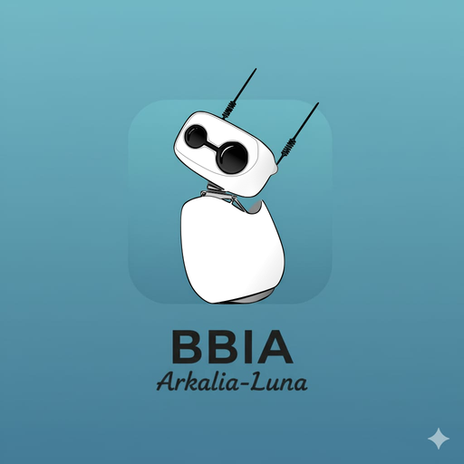
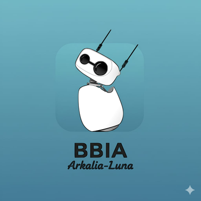
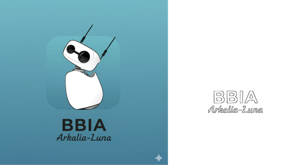

# 🎨 BBIA BRANDING

<div align="center">

**Assets Premium pour l'identité visuelle BBIA**

[](https://github.com)
[](https://github.com)
[](https://github.com)
[](https://www.python.org/)
[](https://inkscape.org/)
[](https://github.com)

[Logo 2D](#-logo-2d) • [Style Guide](#-style-guide) • [Documentation](#-documentation) • [Scripts](#️-scripts--automatisation)

---

<div align="center">
  
</div>

**Identité visuelle premium pour BBIA Reachy Mini**  
*Clean, professionnel, moderne*

</div>

---

## 📋 TABLE DES MATIÈRES

- [🎯 Vue d'ensemble](#-vue-densemble)
- [🎨 Logo 2D](#-logo-2d)
- [📐 Style Guide](#-style-guide)
- [🛠️ Scripts & Automatisation](#️-scripts--automatisation)
- [📚 Documentation](#-documentation)
- [📊 Progression](#-progression)
- [🚀 Démarrage rapide](#-démarrage-rapide)

---

## 🎯 VUE D'ENSEMBLE

**BBIA Branding** est une collection complète d'assets visuels premium pour l'identité de marque BBIA. Le projet inclut des logos vectoriels, des guides de style, des scripts d'automatisation et une documentation complète.

### ✨ Caractéristiques

- ✅ **Logos vectoriels** (SVG) haute qualité
- ✅ **Multi-formats** (PNG, SVG, WebP)
- ✅ **Déclinaisons complètes** (Mark Only, Vertical, Horizontal)
- ✅ **Style Guide professionnel** (palette, typographie, usage)
- ✅ **Scripts d'automatisation** Python
- ✅ **Documentation exhaustive** (15+ guides)
- ✅ **10 logos créés** (Mark Only, Vertical, Horizontal, Favicon)
- ✅ **85% progression** (Logo 2D 100% complet)

---

## 🎨 LOGO 2D

### Versions disponibles

<div align="center">

#### Mark Only (Symbole seul)

| Format | Fichier | Usage |
|--------|---------|-------|
| SVG | `bbia_mark_only_v2_SOURCE.svg` | Vectoriel source (fichier principal) |
| PNG | `bbia_mark_only_v2.png` | Haute résolution (taille originale) |
| PNG | `bbia_mark_only_512x512.png` | Web (512×512px) |
| PNG | `bbia_favicon_32x32.png` | Favicon (32×32px) |


#### Vertical (Symbole + texte empilés)

| Format | Fichier | Dimensions |
|--------|---------|------------|
| SVG | `bbia_logo_vertical_v2_SOURCE.svg` | Vectoriel source (fichier principal) |
| PNG | `bbia_logo_vertical_v2.png` | Haute résolution (taille originale) |



#### Horizontal (Symbole + texte côte à côte)

| Format | Fichier | Dimensions |
|--------|---------|------------|
| SVG | `bbia_logo_horizontal_SOURCE.svg` | Vectoriel source (fichier principal) |
| PNG | `bbia_logo_horizontal.png` | Web (1024px largeur, hauteur auto) |



</div>

### 📁 Emplacement

Tous les logos sont dans : [`logo_2d/final/`](logo_2d/final/)

**Fichiers sources (SVG)** :

- `bbia_mark_only_v2_SOURCE.svg` - Mark Only (source)
- `bbia_logo_vertical_v2_SOURCE.svg` - Logo vertical (source)
- `bbia_logo_horizontal_SOURCE.svg` - Logo horizontal (source)

**Fichiers finaux (PNG)** :

- `bbia_mark_only_v2.png` - Mark Only haute résolution
- `bbia_mark_only_512x512.png` - Mark Only web
- `bbia_logo_vertical_v2.png` - Logo vertical haute résolution
- `bbia_logo_horizontal.png` - Logo horizontal web
- `bbia_favicon_32x32.png` - Favicon

---

## 📐 STYLE GUIDE

### Palette de couleurs

<div align="center">

| Couleur | Hex | Usage |
|---------|-----|-------|
| **BBIA Blue** | `#0066FF` | Primaire (logo, accents) |
| **BBIA White** | `#FFFFFF` | Secondaire (fond, espace) |
| **BBIA Gray** | `#2C2C2C` | Tertiaire (texte) |
| **BBIA Blue Light** | `#3399FF` | Hover, états actifs |
| **BBIA Gray Light** | `#E5E5E5` | Bordures, fonds |

</div>

> **Note** : Les logos utilisent des couleurs réelles différentes. Voir [`logo_2d/final/COULEURS_REELLES_LOGOS.md`](logo_2d/final/COULEURS_REELLES_LOGOS.md) pour les détails.

### Typographie

- **Titres** : Inter Bold, 48px (desktop) / 32px (mobile)
- **Corps** : Inter Regular, 16px (desktop) / 14px (mobile)
- **Code** : JetBrains Mono Regular, 14px

### Documentation complète

📄 **[Style Guide One-Page](style_guide/STYLE_GUIDE_ONE_PAGE.md)** - Guide synthétique  
📄 **[Palette Couleurs](style_guide/palette_couleurs.md)** - Détails couleurs  
📄 **[Typographie](style_guide/typographie.md)** - Détails typographie  
📄 **[Usage Logo](style_guide/usage_logo.md)** - Règles d'usage

---

## 🛠️ SCRIPTS & AUTOMATISATION

### Scripts disponibles

| Script | Description | Usage |
|--------|-------------|-------|
| `generate_all_logos.py` | Vérifie et génère tous les logos manquants | `python3 generate_all_logos.py` |
| `create_horizontal_logo.py` | Crée le logo horizontal depuis le vertical | `python3 create_horizontal_logo.py` |
| `create_visual_tests.py` | Génère des mockups de test visuel | `python3 create_visual_tests.py` |
| `open_visual_tests.py` | Ouvre les tests visuels et le favicon | `python3 open_visual_tests.py` |
| `organize_files.py` | Organise les fichiers anciens | `python3 organize_files.py` |

### 🤖 Automatisation avec Arkalia-LUNA

**Scripts préparés** (quand BBIA Branding dans T7) :

- ✅ `bbia_generate_declinations.py` - Génération déclinaisons dimensionnelles
- ✅ `bbia_visual_tests.py` - Tests visuels automatiques

📄 Voir [`ACTIVATION_SCRIPTS_T7.md`](ACTIVATION_SCRIPTS_T7.md) pour l'activation.

---

## 📚 DOCUMENTATION

### Guides Logo 2D

- 📄 **[SOLUTION_LOGO_EXACT.md](logo_2d/SOLUTION_LOGO_EXACT.md)** - Workflow complet logo exact
- 📄 **[GUIDE_STYLISATION.md](logo_2d/GUIDE_STYLISATION.md)** - Comment styliser
- 📄 **[COMPARAISON_INKSCAPE_FIGMA.md](logo_2d/COMPARAISON_INKSCAPE_FIGMA.md)** - Comparaison outils
- 📄 **[DECLINAISONS_MARK_ONLY.md](logo_2d/DECLINAISONS_MARK_ONLY.md)** - Versions mark only
- 📄 **[TESTS_FOND_SOMBRE.md](logo_2d/TESTS_FOND_SOMBRE.md)** - Tests sur fonds sombres
- 📄 **[INSTALLATION_INKSCAPE_T7.md](logo_2d/INSTALLATION_INKSCAPE_T7.md)** - Installation Inkscape

### Guides Validation & Tests

- 📄 **[VALIDATION_FINALE.md](VALIDATION_FINALE.md)** - Checklist complète
- 📄 **[AUDIT_FINAL.md](AUDIT_FINAL.md)** - Audit complet du projet
- 📄 **[GUIDE_TEST_VISUEL.md](GUIDE_TEST_VISUEL.md)** - Guide test visuel
- 📄 **[TESTS_VISUELS_RESULTATS.md](TESTS_VISUELS_RESULTATS.md)** - Résultats tests

### Guides Intégration

- 📄 **[INTEGRATION_ARKALIA_LUNA.md](INTEGRATION_ARKALIA_LUNA.md)** - Intégration Arkalia-LUNA
- 📄 **[ACTIVATION_SCRIPTS_T7.md](ACTIVATION_SCRIPTS_T7.md)** - Activation scripts T7

### Références

- 📄 **[README_LOGOS.md](logo_2d/final/README_LOGOS.md)** - Répertoire complet des logos
- 📄 **[COULEURS_REELLES_LOGOS.md](logo_2d/final/COULEURS_REELLES_LOGOS.md)** - Couleurs réelles utilisées

---

## 📊 PROGRESSION

<div align="center">

| Catégorie | Statut | Progression |
|-----------|--------|-------------|
| **Logo 2D** | ✅ Complet | 100% |
| **Documentation** | ✅ À jour | 100% |
| **Style Guide** | ✅ Complet | 100% |
| **Tests visuels** | ⚠️ À faire | 0% |
| **Hero Render 3D** | ❌ Non commencé | 0% |
| **Déclinaisons** | ❌ Automatisé | 0% |

**Progression globale** : **85%**

</div>

### ✅ Ce qui est fait

- ✅ Logo 2D complet (Mark Only, Vertical, Horizontal)
- ✅ Fichiers SVG + PNG haute qualité
- ✅ Favicon 32×32px
- ✅ Style Guide complet
- ✅ Documentation exhaustive (15+ guides)
- ✅ Scripts d'automatisation préparés

### ⏳ À faire

- [ ] Tests visuels manuels (30 min)
- [ ] Hero Render 3D (15h)
- [ ] Déclinaisons dimensionnelles (automatisées quand dans T7)

---

## 🚀 DÉMARRAGE RAPIDE

### 1. Utiliser les logos

```bash
# Copier un logo
cp logo_2d/final/bbia_mark_only_512x512.png /path/to/your/project/

# Utiliser le favicon
cp logo_2d/final/bbia_favicon_32x32.png /path/to/your/project/favicon.png
```

### 2. Générer tous les logos

```bash
cd logo_2d/final
# Utiliser le script de réexport avec Inkscape (génère depuis les _SOURCE.svg)
python3 reexport_correct_colors.py
```

### 3. Tester visuellement

```bash
cd logo_2d/final
python3 open_visual_tests.py
```

### 4. Consulter la documentation

- **Style Guide** : [`style_guide/STYLE_GUIDE_ONE_PAGE.md`](style_guide/STYLE_GUIDE_ONE_PAGE.md)
- **Audit complet** : [`AUDIT_FINAL.md`](AUDIT_FINAL.md)
- **Validation** : [`VALIDATION_FINALE.md`](VALIDATION_FINALE.md)

---

## 📁 STRUCTURE DU PROJET

```text
bbia_branding/
├── logo_2d/              # Logo 2D (SVG + PNG)
│   ├── final/            # Fichiers finaux
│   └── procreate_layers/ # Calques Procreate
├── hero_render/          # Rendu 3D principal
├── variants/             # Déclinaisons
│   ├── square_1_1/      # 1:1 pour réseaux
│   ├── landscape_16_9/   # 16:9 pour site
│   ├── portrait_9_16/    # 9:16 optionnel
│   └── favicon/          # 32x32
└── style_guide/          # Documentation
    ├── STYLE_GUIDE_ONE_PAGE.md
    ├── palette_couleurs.md
    ├── typographie.md
    └── usage_logo.md
```

---

## 💡 CONSEILS IMPORTANTS

### Logo 2D

- ✅ **Styliser, pas copier** : Voir [`GUIDE_STYLISATION.md`](logo_2d/GUIDE_STYLISATION.md)
- ✅ **Tester en 32px** : Toujours vérifier lisibilité
- ✅ **Tester tous les fonds** : Clair, sombre, coloré

### Hero Render

- ⏳ **Timer 15h max** : Ne pas perfectionner à l'infini
- ⏳ **Qualité > Perfection** : "Bon" = shipped

### Déclinaisons

- ✅ **Mark only** : Essentiel pour favicon, badges
- ✅ **Tous formats** : SVG (vectoriel) + PNG (raster)

---

## 📞 CONTACT & RESSOURCES

**Projet** : BBIA Reachy Mini  
**Version** : 1.0 Premium  
**Dernière mise à jour** : 2025-11-15

**Pour commencer** : Voir [`logo_2d/SOLUTION_LOGO_EXACT.md`](logo_2d/SOLUTION_LOGO_EXACT.md)

---

<div align="center">

**Made with ❤️ for BBIA**

[⬆ Retour en haut](#-bbia-branding)

</div>

---

## 📝 NOTES

Les warnings Markdown concernant le HTML inline (`<div>`, ``) sont intentionnels pour améliorer l'affichage sur GitHub. Le HTML est nécessaire pour le centrage et les images dimensionnées.
# Test
